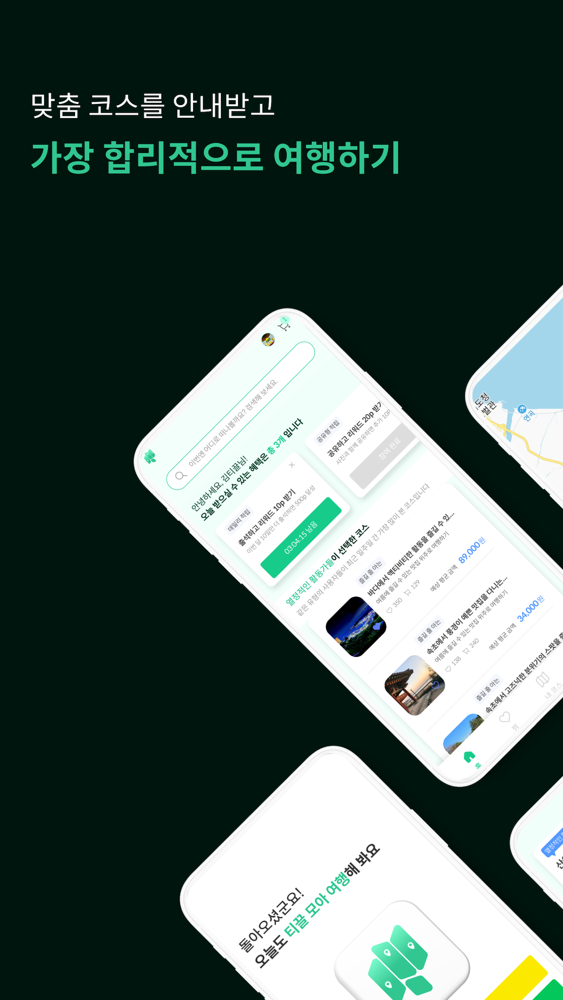
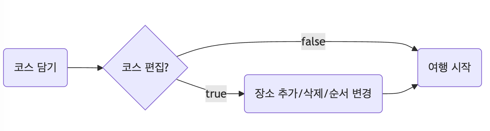

<div align="center">
    
    <h1 align="center">Tikkeul React Web</h1>
</div>

이 프로젝트는 **한국관광공사** x **Kakao** 주최 ['2024 관광데이터 활용 공모전'](https://www.2024tourapi.com/) 출품작입니다. (**장려상** 수상)

<div style="display: flex; flex-wrap: nowrap; gap: 5px;">
  
  
  
</div>

## 목차

- [1. Getting Started](#1-getting-started)
- [2. 기술 스택](#2-기술-스택)
- [3. 서비스 아키텍쳐](#3-서비스-아키텍쳐)
- [4. 기능 구현 내용](#4-기능-구현-내용)
- [5. Demo](#5-demo)

## 1. Getting Started

#### Install

```
yarn install
```

#### Dev mode

```
yarn dev
```

#### Storybook

```
yarn sb
```


#### 환경변수
```
VITE_SERVER_URL={SERVER_URL}
VITE_KAKAO_JS_KEY={KAKAO_JS_KEY}
VITE_KAKAO_REST_KEY={KAKAO_REST_KEY}
```

#### 개발환경

```
NodeJS-18.18.0
yarn-1.22.21
```

## 2. 기술 스택

#### Framework & Language

- React 18.x
- TypeScript 5.x

#### State Management & Data Fetching

- React Query (TanStack Query) ^5.56.2

#### Styling & Animations

- MUI (Material-UI) ^5.16.7
- Emotion (CSS-in-JS) ^11.13.0
- Framer Motion ^11.3.30

#### Form & Validation

- React Hook Form ^7.53.0
- Yup (Schema Validation) ^1.4.0

#### Development & Build Tools

- Vite ^5.4.1 (Development & Build Tool)
- Storybook ^8.2.9 (Component Development Environment)
- ESLint & Prettier (Linting & Formatting)
- Chromatic (Visual Testing)


## 3. 서비스 아키텍쳐


## 4. 기능 구현 내용

### 4.1. 회원 관련


#### 4.1.1. 로그인


카카오 OAuth 로그인 기능은 다음과 같이 구현되었습니다:

1. 사용자가 클라이언트에서 카카오 로그인을 요청하면 서버에 해당 요청이 전달됩니다.
2. 서버는 카카오 인증 서버에 인가 코드를 요청합니다.
3. 카카오 인증 서버는 사용자의 카카오 계정 로그인을 위해 클라이언트로 리다이렉션합니다.
4. 사용자는 클라이언트에서 카카오 계정으로 로그인합니다.
5. 로그인 성공 시, 카카오 인증 서버는 설정된 리다이렉트 URI를 통해 인가 코드를 서버로 전달합니다.
6. 서버는 이 인가 코드를 사용하여 카카오 인증 서버에 액세스 토큰 발급을 요청합니다.
7. 카카오 인증 서버는 서버에 액세스 토큰을 발급해줍니다.
8. 서버는 발급받은 토큰 정보를 클라이언트에 전달하며, 클라이언트는 쿠키(`set-cookie`)로 토큰을 저장하여 이후 인증에 활용할 수 있습니다.

이러한 과정으로 클라이언트와 카카오 인증 서버 간의 인증 및 토큰 교환이 이뤄져 안전한 로그인 및 인증이 가능합니다.

#### 4.1.2. 회원가입


회원가입은 최초 로그인 여부에 따라 진행됩니다.

1. **로그인 요청**: 사용자가 로그인 버튼을 누르면 프로세스가 시작됩니다.
2. **최초 로그인 여부 확인**:
    - 사용자가 처음 로그인하는 경우 회원가입 페이지로 리다이렉트됩니다.
    - 이미 회원 가입이 되어 있는 경우에는 바로 "로그인 완료"로 이동합니다.
3. **회원 정보 입력**:
    - 최초 로그인일 경우, 이름, 나이, 성별 등 필수 정보를 입력받는 단계로 이동합니다.
4. **회원가입 완료**:
    - 정보 입력이 완료되면 회원가입이 완료됩니다.
    - 이 과정 이후에 로그인 상태로 전환되어 "로그인 완료" 단계로 이동합니다.
5. **로그인 완료**:
    - 회원가입이 완료된 경우나 기존 회원일 경우 모두 이 단계로 이동하며, 최종적으로 로그인 상태가 유지됩니다.

이러한 흐름은 사용자가 최초로 로그인하는지 여부를 판단하여 필요한 경우 추가 정보를 입력하게 하고, 그렇지 않다면 바로 로그인 완료 상태로 이동합니다

### 4.3. 그룹 생성 및 추천 코스

#### 4.3.1. 코스 경로 찾기


1. **코스 데이터 요청 및 응답**:
    - 클라이언트는 서버에 추천 경로와 관련된 데이터를 요청하고 서버는 그에 맞는 코스 데이터를 응답합니다. 이 데이터는 사용자의 요구에 맞는 경로 추천 정보를 포함하고 있습니다.
2. **다중 경유지 길찾기 API 사용**:
    - 클라이언트는 서버로부터 받은 코스 데이터를 기반으로 카카오의 다중 경유지 길찾기 API를 호출하여 경로를 계산합니다. 이때 API는 경유지를 모두 포함한 최적 경로의 좌표값을 반환합니다.
3. **경로 시각화**:
    - 클라이언트는 받은 좌표값을 바탕으로 카카오 맵 API를 활용해 지도에 경로를 시각화합니다. 맵 API를 요청하면 카카오 서버는 해당 경로를 지도로 렌더링해 클라이언트에 전달합니다.

이러한 과정으로 사용자는 추천된 코스와 최적화된 경로를 지도로 확인할 수 있습니다.

#### 4.3.2. 그룹 생성


여행 코스 추천은 서비스내에서 그룹이라는 단위로 이루어집니다.

1. **인원/여행일/선호도 조사**: 여행을 함께할 인원, 여행 날짜, 선호도 등에 대한 조사를 통해 사용자의 요구사항을 수집합니다.
2. **그룹 생성**: 수집된 정보를 바탕으로 함께 여행할 그룹을 구성하거나, 그룹에 사용자를 추가합니다. 
3. **추천 코스 제공**: 사용자 선호도 및 그룹 특성을 기반으로 최적화된 추천 코스를 제공합니다.
4. **재검사 여부 확인**: 추천된 코스가 만족스러운지 확인하는 단계입니다.
    - `true`: 만족스럽지 않은 경우, 다시 선호도 및 인원 등의 조사를 거쳐 재추천 과정을 진행합니다.
    - `false`: 만족스러운 경우, 추천된 코스로 바로 여행을 시작합니다. (아래 4번)
5. **여행하기**: 최종적으로 결정된 추천 코스를 기반으로 여행을 시작할 수 있습니다.

이 흐름을 통해 사용자에게 맞춤형 코스가 제공되며, 필요에 따라 재검사와 수정이 가능합니다.

#### 4.3.3 추천 시스템


1. **데이터 수집 및 저장 (데이터 파이프라인 구축)**: 외부 데이터와 API를 활용해 수집한 관광 데이터를 전처리 후 로컬 DB에 일괄 저장 및 자동화했습니다.
2. **코스 분석 및 세부 점수 산출**: 코스 데이터의 카테고리를 분석해 초기에는 메타 정보로, 이후 유저 데이터로 세부 점수를 산출하는 방향으로 확장할 수 있습니다.
3. **가중치 기반 맞춤형 추천 제공**: 유저 타입에 따른 가중치를 기반으로 개인화된 코스 추천을 백엔드에서 제공합니다
4. **DB 업데이트 및 가중치 동기화**: 관광 정보의 정기적 업데이트 및 가중치 동기화로 최신 개인화 추천을 제공합니다


### 4.4. 코스 담기 및 공유  

#### 4.4.1. 코스 담기 및 편집



사용자가 코스를 담은 이후의 흐름입니다:

1. **코스 담기**: 사용자가 관심 있는 장소나 코스를 담기 시작합니다.
2. **코스 편집 여부**: 담은 코스를 편집할지 선택하는 단계입니다.
    - `true`: 코스 편집이 필요한 경우.
    - `false`: 편집이 필요 없을 경우 바로 다음 단계로 진행됩니다.
3. **장소 추가/삭제/순서 변경**: 편집이 필요한 경우 사용자가 코스에 장소를 추가하거나 삭제하고, 순서를 변경할 수 있습니다.
4. **여행 시작**: 코스 편집이 완료되면 최종적으로 확정된 코스로 여행을 시작할 수 있게 됩니다.

이러한 흐름을 통해 사용자는 여행 코스를 유연하게 편집하고, 준비가 되면 바로 여행을 시작할 수 있습니다.

#### 4.4.2. 코스 공유하기


여행을 시작하면 사용자는 코스를 공유할 수 있습니다. 클라이언트에서 코스를 공유하는 기능은 다음과 같은 프로세스로 이루어집니다:

1. **코스 데이터 공유**:
    - 사용자가 공유하기 버튼을 클릭하면, 서버는 코스 데이터를 base64로 인코딩해 반환합니다. 이 인코딩된 데이터는 URL로 변환되어 공유가 용이하도록 합니다.
2. **URL 복사 및 공유**:
    - 클라이언트는 인코딩된 코스 데이터를 클립보드에 복사하고 공유할 수 있게 합니다. 이렇게 하면 사용자가 특정 코스에 대한 링크를 쉽게 전송할 수 있습니다.
3. **코스 데이터 디코딩**:
    - 공유된 URL의 데이터를 다시 사용하려면 클라이언트는 인코딩된 값을 서버로 전송합니다. 서버는 해당 값을 디코딩하여 JSON 형태의 원래 코스 데이터를 반환합니다.

이러한 과정으로 사용자 간에 코스 공유와 데이터 복원이 간편하게 이루어집니다.

## 5. Demo

### 운영 종료 ~~[티끌모아강원 바로가기](https://tikkeul.netlify.app/)~~
### [스토리북 컴포넌트 가이드](https://66c405b6b83833a9c5e7136e-nqhokgcgkt.chromatic.com/)

## 5.1. 랜딩페이지 - 찜 페이지


## 5.2. 검색페이지


## 5.3. 그룹 생성


## 5.4. 코스 상세보기


## 5.5. 공유


